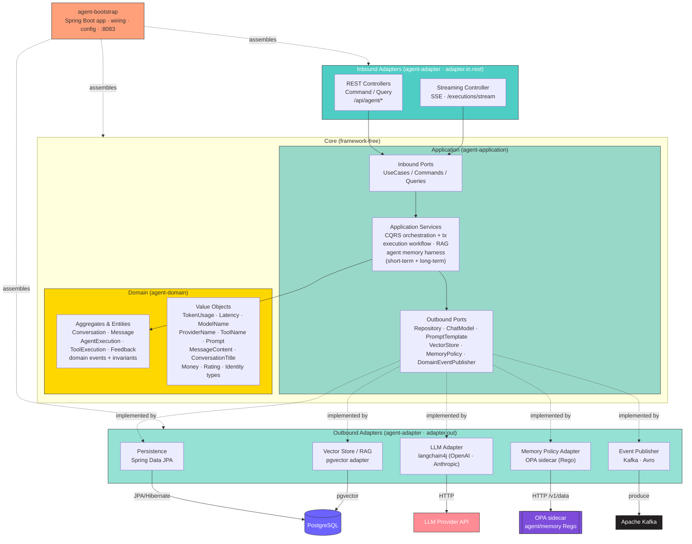

# Agent Service

A Spring Boot 4 microservice that manages AI agent conversations, execution tracking, and tool-call orchestration for the SaaS platform. It models the full lifecycle of a multi-turn conversation — from the user's first message through every LLM invocation and tool call — and records token usage, latency, and cost for downstream billing. LLM access goes through langchain4j (OpenAI / Anthropic), responses can be streamed to clients over Server-Sent Events, and prior turns are retrieved for context via pgvector-backed RAG.


## Architecture

The service follows a **Domain-Driven Design / hexagonal (ports & adapters)** layout split across four Gradle modules. The domain and application core have **no framework dependencies**; all I/O crosses through ports implemented by adapters. Dependencies point inward — `agent-adapter` and `agent-bootstrap` depend on `agent-application`, which depends on `agent-domain`; `agent-domain` depends on nothing.



> gRPC client/server dependencies are present but no downstream service is wired yet, so gRPC is omitted from the diagram above.

## Agent Harness & Memory

The agent's memory sits behind a **harness** (application layer, `execution.service.harness`)
that both manages it as two tiers and governs what crosses the memory boundary. The workflow
talks only to `AgentMemory`.

**Two tiers.** Each turn's prompt is assembled tier by tier:

- **Short-term (working) memory** (`ShortTermMemory`) — the recent turns of the live
  conversation, verbatim, bounded to a window (`agent.memory.short-term.max-messages`) so a
  long conversation can't grow the prompt without limit. Recency-based, and **secret-redacted**
  on the way into the prompt (`SecretRedactor`) so a credential a user pasted is answered around
  but never echoed back.
- **Long-term memory** (pgvector, behind `RagService`) — everything the agent has said in the
  conversation, recalled by semantic relevance rather than recency, score-gated and fused over
  dense + sparse retrieval. Turns that age out of the short-term window are still here.

**Governance.** Whatever lands in long-term memory gets replayed to the model on later turns,
so you don't want a leaked API key or one tenant's data embedded, remembered, and quietly
re-served. `AgentMemoryHarness` checks every long-term **recall** (after relevance gating) and
**persist** against a policy, and drops what it denies (short-term redacts instead, since the
model needs the live turn). The verdict isn't hard-coded: it's delegated through a
`MemoryPolicyPort` to **Open Policy Agent** running the `policy/agent/memory.rego` bundle — the
same policy-as-code engine this repo already uses to lint Dockerfiles in CI, now on the runtime
path. Rules (secret redaction, tenant retention opt-out, cross-tenant isolation) change by
shipping Rego, not by redeploying.

**Rate limiting.** The expensive long-term operations (recall, persist) are metered per
conversation by a Bucket4j token bucket (`MemoryRateLimiter`). Over budget, the harness skips
that turn's long-term work — recall falls back to short-term memory, a persist is dropped —
rather than failing the turn.

**Resilience.** The two external calls memory makes — OPA and pgvector — are each wrapped in a
Resilience4j circuit breaker (`memoryPolicy`, `vectorStore`), so a slow or broken dependency
fails fast and degrades instead of hanging the turn. On an OPA outage the harness applies a
configured posture — fail-closed by default (drop the recall, skip the persist); on a vector
outage recall falls back to the short-term window plus a grounding guard.

Governance is off by default (`agent.memory.policy.enabled=false`): a pass-through adapter
allows everything, so local and dev runs need no OPA sidecar. Full write-up in
[`docs/agent-memory-harness.md`](docs/agent-memory-harness.md).

## Domain Model

The agent-service domain is richer than a typical CRUD service. Three bounded-context areas work together:

### Aggregates & Entities

| Type | Class | Description |
|---|---|---|
| Aggregate | `Conversation` | Root aggregate. Owns an ordered list of `Message` entities. Enforces active-state invariant — only active conversations accept new messages. Supports `rename`, `archive`, `delete`, `activate`. |
| Entity | `Message` | A single turn in the conversation. Carries a `MessageRole` (`USER`, `ASSISTANT`, `SYSTEM`, `TOOL`), `MessageContent`, and `TokenUsage`. |
| Entity | `AgentExecution` | One LLM invocation triggered by a conversation turn. Tracks `ModelName`, `ProviderName`, `TokenUsage`, `Money` (cost), `Latency`, and a list of `ToolExecution`s. State machine: `RUNNING → COMPLETED | FAILED | TIMEOUT`. |
| Entity | `ToolExecution` | A single tool/function call made during an `AgentExecution`. Holds the `ToolName`, `MessageContent` request and response, `Latency`. State machine: `RUNNING → COMPLETED | FAILED`. |

### Domain Model Diagram

```
Conversation (Aggregate Root)
│  ConversationId, TenantId, UserId
│  ConversationTitle, ConversationStatus (ACTIVE / ARCHIVED / DELETED)
│  createdAt, updatedAt
│
└─── Message (Entity) [1..*]
       MessageId, MessageRole (USER / ASSISTANT / SYSTEM / TOOL)
       MessageContent (max 100 000 chars), TokenUsage, createdAt

AgentExecution (Entity)
│  AgentExecutionId, ConversationId (ref)
│  ModelName, ProviderName
│  AgentExecutionStatus (RUNNING / COMPLETED / FAILED / TIMEOUT)
│  TokenUsage (promptTokens + completionTokens → totalTokens)
│  Money (amount + currency, 4 dp), Latency (Duration)
│  startedAt, completedAt
│
└─── ToolExecution (Entity) [0..*]
       ToolExecutionId, ToolName
       MessageContent (request), MessageContent (response)
       ToolExecutionStatus (RUNNING / COMPLETED / FAILED)
       Latency, startedAt, completedAt
```

### Value Objects

**AI**
- `TokenUsage` — `promptTokens`, `completionTokens`; computed `totalTokens()`; validated non-negative
- `ModelName` — non-blank string; e.g. `"gpt-4o"`, `"claude-3-5-sonnet"`
- `ProviderName` — non-blank string; e.g. `"openai"`, `"anthropic"`
- `ToolName` — non-blank string identifier for a registered tool
- `Prompt` — non-blank string system/user prompt
- `Latency` — wraps `Duration`; validated non-negative; `toMillis()` helper

**Conversation**
- `ConversationTitle` — trimmed, non-blank, max 255 chars
- `MessageContent` — non-blank, max 100 000 chars; used for both message body and tool request/response payloads

**Billing**
- `Money` — `BigDecimal` amount (4 dp, `HALF_UP`) + `Currency`; supports `add(Money)` with currency-match guard
- `Rating` — integer 1–5; `positive()` returns `true` for ≥ 4

**Identity** (all are UUID-backed records)
- `ConversationId`, `MessageId`, `AgentExecutionId`, `ToolExecutionId`, `FeedbackId`, `UserId`, `TenantId`

### Infrastructure Abstractions

- `AbstractAggregateRoot` — base class for aggregates; holds an internal `List<DomainEvent>` with `registerEvent`, `domainEvents()`, and `clearDomainEvents()`
- `DomainEvent` — interface with `eventId()` and `occurredAt()`

## Tech Stack

| Concern | Technology |
|---|---|
| Runtime | Java 21 |
| Framework | Spring Boot 4 |
| Build | Gradle 9 |
| Database | PostgreSQL (Spring Data JPA / Hibernate) |
| LLM | langchain4j (OpenAI + Anthropic chat models) |
| RAG / Vectors | pgvector (via langchain4j-pgvector) |
| Messaging | Apache Kafka (Avro + Confluent Schema Registry) |
| Policy | Open Policy Agent (Rego) — runtime memory governance + Dockerfile linting (conftest) |
| Internal RPC | gRPC (Buf Registry, spring-grpc) — dependencies present, not yet wired |
| Code Quality | SonarQube / SonarCloud (sonar-scanner) + JaCoCo coverage |
| Resilience | Resilience4j (circuit breaker + retry) |
| Rate limiting | Bucket4j (per-conversation token buckets on memory ops) |
| API Docs | SpringDoc OpenAPI / Swagger UI |
| Observability | OpenTelemetry (Spring Boot starter), Actuator |
| Testing | JUnit 5, Testcontainers, Spring REST Docs, Mockito |

## Project Structure

Four Gradle modules, wired together by `agent-bootstrap`. Package root is `com.project.agent`.

```
agent-service/
├── agent-domain/                # Pure domain — no framework deps
│   └── src/main/java/.../domain/
│       ├── conversation/        # Conversation aggregate + ConversationStatus
│       ├── message/             # Message entity + MessageRole
│       ├── execution/
│       │   ├── agent/           # AgentExecution entity + AgentExecutionStatus
│       │   └── tool/            # ToolExecution entity + ToolExecutionStatus
│       ├── feedback/            # Feedback aggregate
│       └── vo/                  # Value objects
│           ├── ai/              # TokenUsage, ModelName, ProviderName, ToolName,
│           │                    #   Prompt, Latency
│           ├── billing/         # Money, Rating
│           ├── conversation/    # ConversationTitle, MessageContent
│           ├── identity/        # ConversationId, MessageId, AgentExecutionId,
│           │                    #   ToolExecutionId, FeedbackId, UserId, TenantId
│           └── shared/          # AbstractAggregateRoot, DomainEvent
│
├── agent-application/           # Use cases + ports (framework-free)
│   └── src/main/java/.../application/
│       ├── conversation/
│       │   ├── port/in/         # Inbound ports (CreateConversation, AddMessage, Queries …)
│       │   ├── port/out/        # Outbound ports (ConversationRepository …)
│       │   └── service/         # Application services (orchestration)
│       ├── execution/           # AgentExecution / ToolExecution use cases + ports + services
│       ├── shared/port/out/     # Shared outbound ports (DomainEventPublisher …)
│       └── exception/           # Application-level exceptions
│
├── agent-adapter/               # Ports & adapters implementations
│   ├── src/main/java/.../adapter/
│   │   ├── in/rest/             # REST controllers (command/query/streaming) + DTOs + mapper
│   │   ├── out/persistence/     # Spring Data JPA repository adapters
│   │   ├── out/llm/             # LLM chat/tool adapters (langchain4j: OpenAI, Anthropic)
│   │   ├── out/vector/          # pgvector RAG adapter
│   │   ├── out/policy/          # Memory-policy adapters (OPA sidecar + allow-all default)
│   │   ├── out/metrics/         # Micrometer adapters (RAG + memory-policy metrics)
│   │   ├── out/messaging/       # Domain event publisher (Kafka + Avro)
│   │   └── out/grpc/            # gRPC client adapter (not yet wired)
│   └── src/main/resources/          # application.properties, application-cred.properties
│
├── agent-bootstrap/             # Spring Boot app — wiring, config, entrypoint
│   └── src/main/
│       ├── java/.../config/     # Spring @Configuration (beans, OTel, etc.)
│       └── resources/
│           ├── application.properties
│           └── application-cred.properties   # secrets (gitignored)
│
├── settings.gradle              # Module includes
└── build.gradle
```

> The domain has **zero framework dependencies**. `agent-domain` and `agent-application` compile with plain Java; `agent-adapter` and `agent-bootstrap` own all Spring/infrastructure wiring.

> Rego policies live at the repo root under `policy/` — `policy/docker/` (Dockerfile linting, run by conftest in CI) and `policy/agent/` (the runtime memory-governance bundle loaded by the OPA sidecar). Both are unit-tested with `conftest verify` in the `security` workflow.

## Getting Started

### Prerequisites

- Java 21
- Gradle 9 (or use the included `./gradlew` wrapper)
- PostgreSQL
- Kafka

### Configuration

The service reads from `application.properties`. Secrets are loaded from `application-cred.properties` (not committed). Key properties:

```properties
# Database
spring.datasource.url=jdbc:postgresql://localhost:5434/agent_db
spring.datasource.username=agent_user
spring.datasource.password=agent_password

# Kafka
spring.kafka.bootstrap-servers=localhost:9092

# gRPC
# gRPC client/server dependencies are included but no downstream service is wired yet.

# OpenTelemetry
management.otlp.metrics.export.url=http://localhost:43180/v1/metrics
management.opentelemetry.tracing.export.otlp.endpoint=http://localhost:43180/v1/traces
management.opentelemetry.logging.export.otlp.endpoint=http://localhost:43180/v1/logs

# Swagger UI (disabled by default, set true in dev)
springdoc.api-docs.enabled=${SPRINGDOC_ENABLED:false}
springdoc.swagger-ui.enabled=${SPRINGDOC_ENABLED:false}

# Agent memory harness — two-tier memory + redaction + rate limit + OPA governance
# (see docs/agent-memory-harness.md)
agent.memory.short-term.max-messages=20
agent.memory.short-term.redact.enabled=true
agent.memory.rate-limit.enabled=true
agent.memory.rate-limit.capacity=30
agent.memory.policy.enabled=${AGENT_MEMORY_POLICY_ENABLED:false}   # off by default
agent.memory.policy.fail-open=false
agent.memory.policy.opa.base-url=${OPA_BASE_URL:http://localhost:8181}
```

Create `agent-bootstrap/src/main/resources/application-cred.properties` with any secrets (API keys, etc.):

```properties
# LLM provider key
ai.provider.api-key=sk-...
```

### Build & Run

```bash
# Build all modules (skips tests)
./gradlew build -x test

# Run (bootRun lives in the bootstrap module)
./gradlew :agent-bootstrap:bootRun

# Or run the fat JAR
java -jar agent-bootstrap/build/libs/agent-bootstrap-0.0.1-SNAPSHOT.jar
```

### Testing

```bash
# Run all tests (requires Docker for Testcontainers)
./gradlew test

# Generate JaCoCo coverage report
./gradlew jacocoTestReport
# Report at: build/reports/jacoco/test/html/index.html
```

## API

Swagger UI: `http://localhost:8083/swagger-ui.html` (requires `SPRINGDOC_ENABLED=true`)  
OpenAPI JSON: `http://localhost:8083/api/v1-docs`

### Key Endpoints

| Method | Path | Description |
| |---|:---|
| `POST` | `/api/v1/agent/conversations` | Create a new conversation |
| `GET` | `/api/v1/agent/conversations/{id}` | Fetch a conversation by ID |
| `GET` | `/api/v1/agent/conversations` | List conversations by `userId` |
| `PATCH` | `/api/v1/agent/conversations/{id}` | Rename a conversation |
| `POST` | `/api/v1/agent/conversations/{id}/messages` | Add a message to a conversation |
| `GET` | `/api/v1/agent/conversations/{id}/messages` | List messages in a conversation |
| `POST` | `/api/v1/agent/conversations/{id}/archive` | Archive a conversation |
| `DELETE` | `/api/v1/agent/conversations/{id}` | Delete a conversation |
| `POST` | `/api/v1/agent/executions` | Run the agent on a conversation turn |
| `POST` | `/api/v1/agent/executions/stream` | Run the agent and stream the response as Server-Sent Events |
| `GET` | `/api/v1/agent/executions/{id}` | Fetch an agent execution by ID |
| `GET` | `/api/v1/agent/executions` | List executions by `conversationId` |
| `POST` | `/api/v1/agent/feedback` | Submit feedback |
| `PATCH` | `/api/v1/agent/feedback/{id}` | Update feedback |
| `GET` | `/api/v1/agent/feedback/{id}` | Fetch feedback by ID |
| `GET` | `/api/v1/agent/feedback` | List feedback by `conversationId` |
| `GET` | `/actuator/health` | Health check |
| `GET` | `/actuator/prometheus` | Prometheus metrics |

## Resilience

**Circuit Breaker** (`llmProvider`):
- Sliding window: 10 calls
- Failure threshold: 50%
- Wait in open state: 10s
- Auto-transition to half-open: enabled

**Retry** (`llmProvider`):
- Exponential backoff (multiplier: 2, base: 300ms)
- Retries on: `StatusRuntimeException`
- Ignores: `IllegalArgumentException`

**Circuit Breaker** (`vectorStore`) — long-term memory (pgvector):
- Sliding window: 20 calls, opens at 50% failure, 10s in open state
- Open circuit degrades to a best-effort miss (grounding guard on recall, no-op on write); config errors (`UnsupportedEmbeddingModelException`) are excluded

**Circuit Breaker** (`memoryPolicy`) — OPA memory-governance calls:
- Sliding window: 20 calls, opens at 50% failure, 15s in open state
- Open circuit is treated as "policy unavailable"; the harness then applies its fail-open / fail-closed posture

## Observability

- **Distributed tracing** — OpenTelemetry traces exported via OTLP (`/v1/traces`)
- **Metrics** — Micrometer + OTLP export (`/v1/metrics`); also exposed at `/actuator/prometheus`
- **Structured logging** — Logback with OpenTelemetry log appender exporting to OTLP (`/v1/logs`)
- **Health** — `/actuator/health` with full details; Resilience4j circuit breaker state surfaced via health indicator

## Code Quality

Static analysis and coverage run in CI (`agent-service-ci.yml`) via the SonarScanner CLI:

```bash
# Generate coverage, then analyse (needs SONAR_TOKEN, and SONAR_HOST_URL for self-hosted)
./gradlew test jacocoTestReport
sonar-scanner
```

Scanner configuration lives in [`sonar-project.properties`](sonar-project.properties); each module emits a JaCoCo XML report that Sonar aggregates for coverage.

## License

MIT
